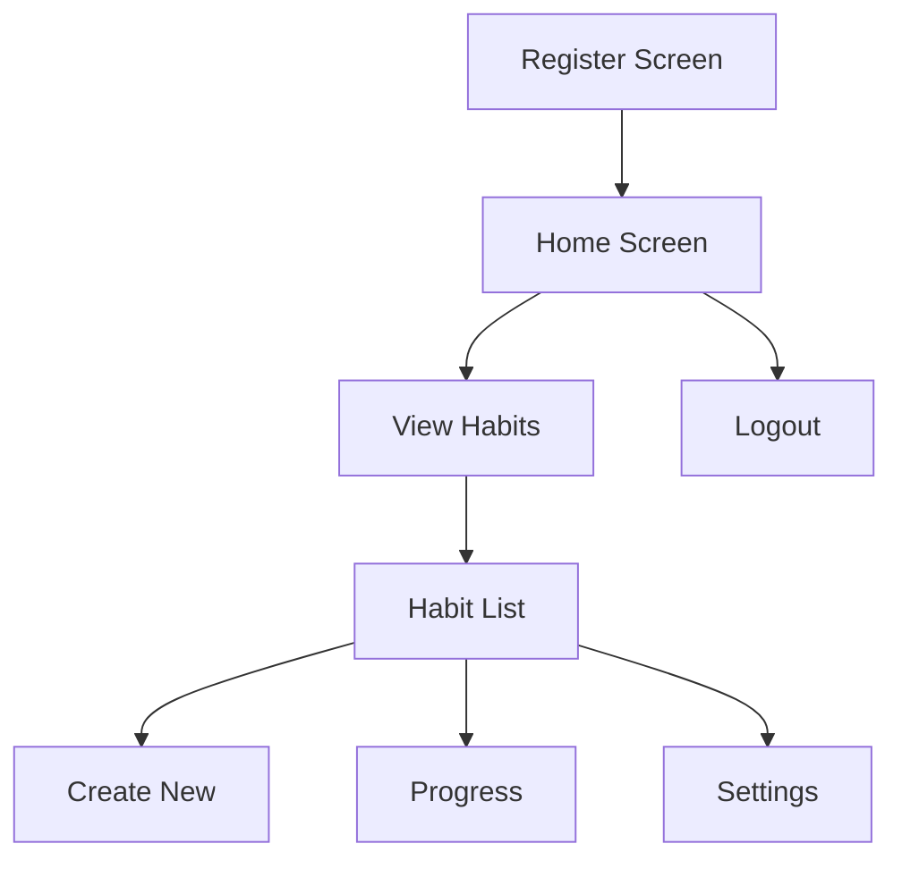
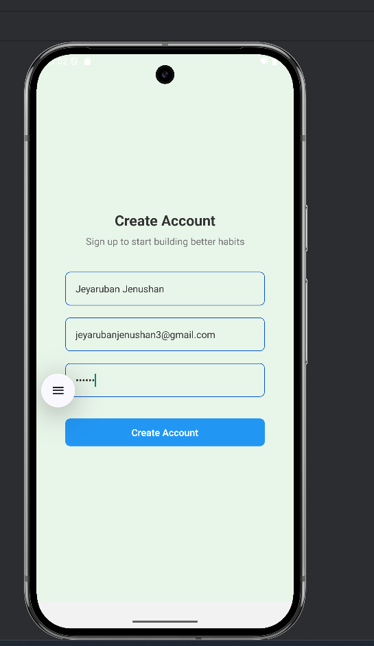
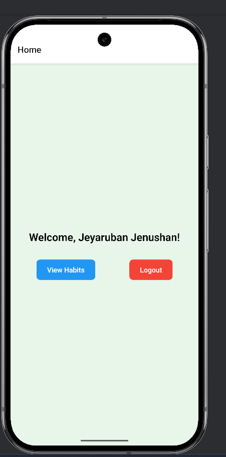
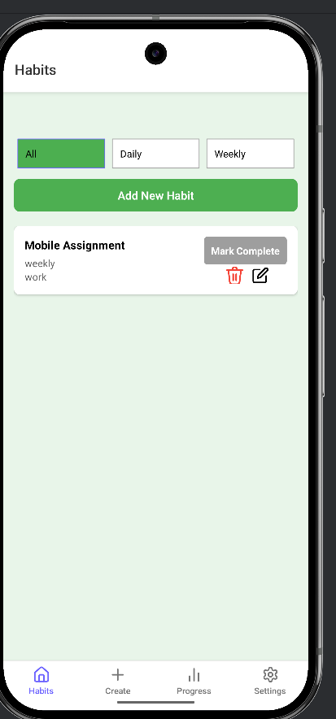
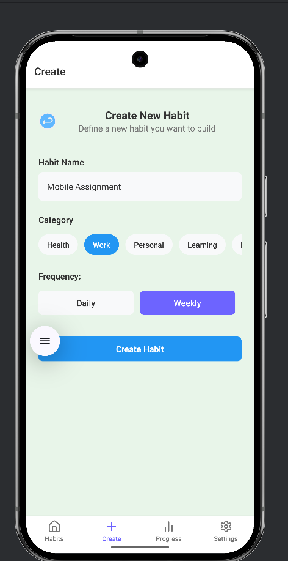
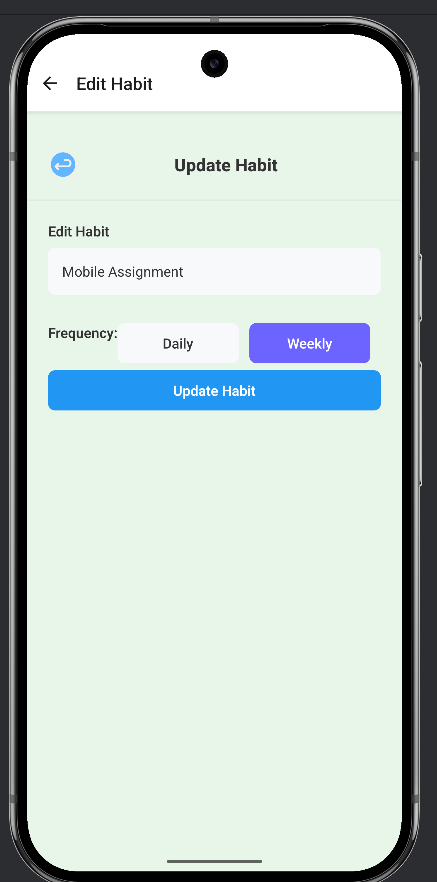
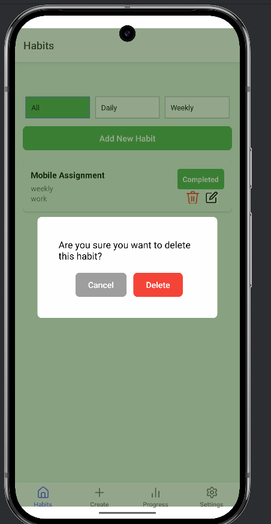
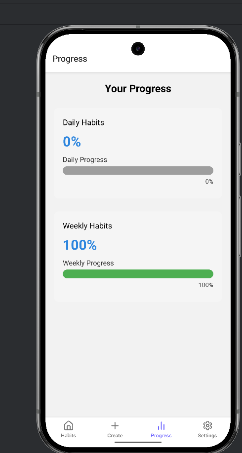
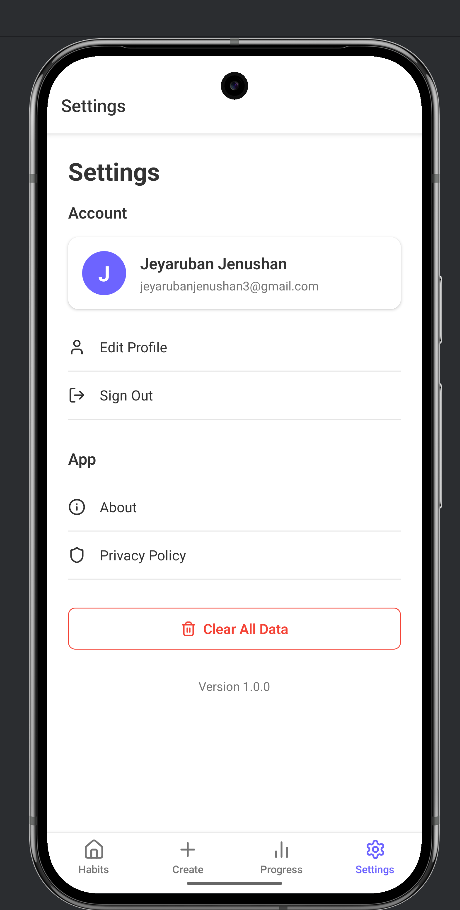

# Habit Tracker App 📱✅

A mobile application to track daily/weekly habits with progress tracking using AsyncStorage.

[](https://drive.google.com/file/d/1nRq6R8UstHOmir4IS92SNT8GgoQ3GLcZ/view?usp=sharing)

## Features ✨

- 🚀 **User Registration** - Start directly with registration
- 📋 **Habit Management** - CRUD operations for habits
- 📊 **Progress Tracking** - Visual completion percentages
- 🗂 **Category Organization** - Daily/Weekly categories
- 💾 **AsyncStorage** - Local data persistence
- 🔄 **Smooth Navigation** - Tab-based interface
- 🎨 **Interactive UI** - Intuitive icons and design

## App Flow 🔄



---

## 👩‍💻 Author

**Jeyaruban Jenushan**  
Third Year Software Engineering Undergraduate  
[GitHub Profile](https://github.com/jeyjenushan)

---

### 📸 Screenshots

|     |     |     |
| --- | --- | --- |

|  |  |  |
|  |  |  |  | |

### 📋 Prerequisites

- Node.js
- Android/iOS device or emulator

## installation

- Clone repository

git clone https://github.com/jeyjenushan/HabitTrackingApp.git
cd habit-tracker-app

- Install dependencies

npm install

- Install pods (iOS)

cd ios && pod install && cd ..

- Run Android

npx react-native run-android

- Run iOS

npx react-native run-ios

---

## 📁 Project Structure

```bash
src/
├── assets/                  # App icons, images (to be created)
├── components/              # Reusable UI components
│   ├── Button.tsx     # Moved to root of components
│   ├── CategoryPicker.tsx
│   │
│   ├── ProgressChart.tsx
│   ├── InputField.tsx
│   └── HabitCard.tsx
├── constants/               # Constant values
│   ├── Colors.ts
│
│
│
├── screens/
│   ├── Auth/
│   │   └── RegisterScreen.tsx
│   ├── Habits/
│   │   ├── AddHabitScreen.tsx
│   │   ├── EditHabitScreen.tsx
│   │   ├── HabitListScreen.tsx
│   │   └── LayoutScreen.tsx
│   ├── ProgressScreen.tsx
│   ├── Setting.tsx
│   └── HomeScreen.tsx
├── services/                # Business logic/services
│   ├── authService.ts
│   ├── habitService.ts
│
├── types/                   # Type definitions
│   ├── types.ts
│
│── storage/
│       └── storage.ts

│
└── App.tsx                  # Main entry point
└── ...
```
