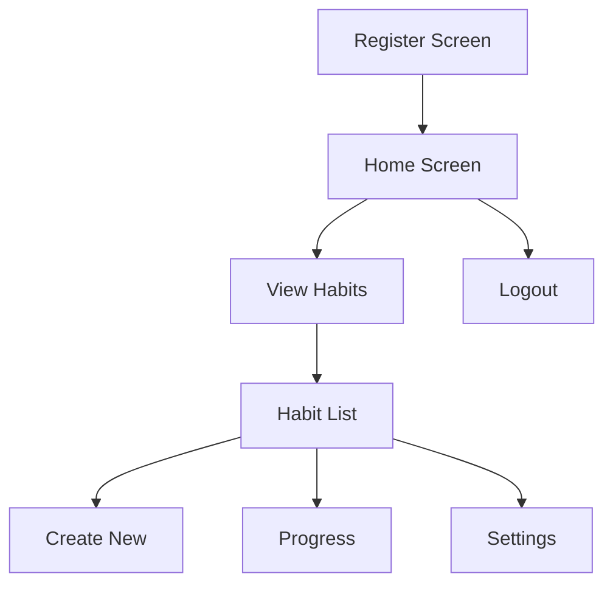

# Habit Tracker App 📱✅

A mobile application to track daily/weekly habits with progress tracking using AsyncStorage.

  
_(Replace with your actual app screenshot URL)_

## Features ✨

- 🚀 **User Registration** - Start directly with registration
- 📋 **Habit Management** - CRUD operations for habits
- 📊 **Progress Tracking** - Visual completion percentages
- 🗂 **Category Organization** - Daily/Weekly categories
- 💾 **AsyncStorage** - Local data persistence
- 🔄 **Smooth Navigation** - Tab-based interface
- 🎨 **Interactive UI** - Intuitive icons and design

## App Flow 🔄

## installation

- Clone repository

git clone https://github.com/jeyjenushan/HabitTrackingApp.git
cd habit-tracker-app

- Install dependencies

npm install

- Install pods (iOS)

cd ios && pod install && cd ..

- Run Android

npx react-native run-android

- Run iOS

npx react-native run-ios
